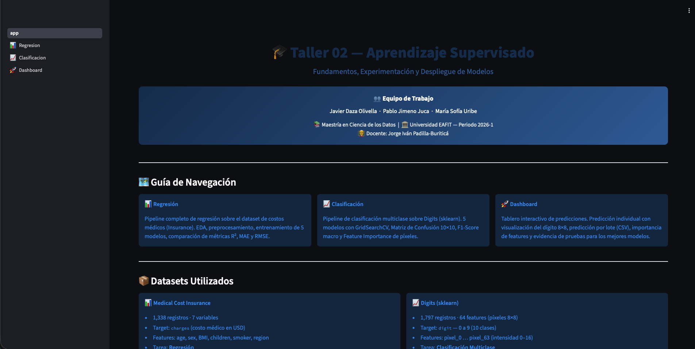

## 🤖 Introduccion a la Inteligencia Artificial 

> Proyecto académico — Maestría en Ciencia de Datos y Analítica
> Universidad EAFIT · 2026-1

👥 Integrantes

- Javier Daza Olivella

- María Sofía Uribe Cano

- Pablo Andrés Jimeno Junca

👨‍🏫 Docente: 
- Jorge Iván Padilla Buriticá

### Workshop_02
[Enlace Streamlit](https://intro-ia-supervised.onrender.com)

